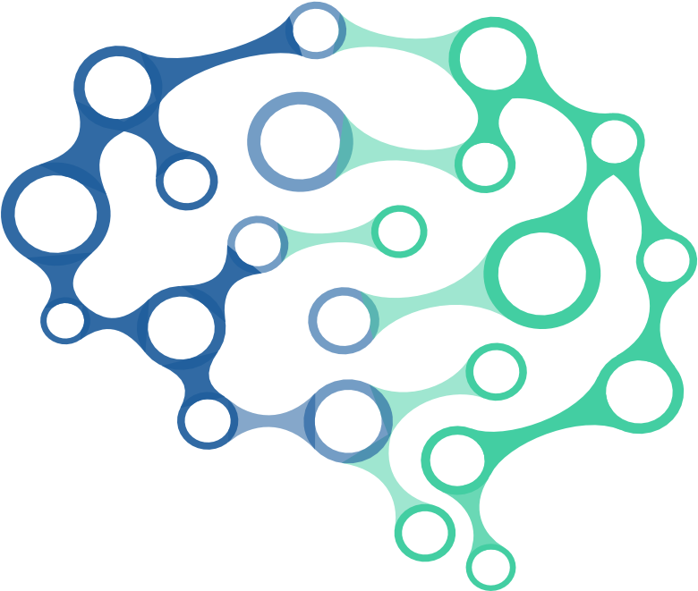

# Hello! I'm Bruno Prado 

I'm a Data Engineering Intern, currently working at [LACTEC](https://www.lactec.com.br/).

I'm a big fan of Data Engineering, AI and Machine Learning, and I'm currently studying to become a data scientist.

Currently, I'm studying at [UCSal](https://ucsal.br/), where I'm studying Software Engineering.
  
  
## My interests
- Data Engineering
- Machine Learning
- Data Science
- Web Scraping

## Tools / languages

- Python 
- Scikit-learn
- Pandas
- SQL
- Apache Airflow
- AWS
- Numpy
- Matplotlib
- Jupyter Notebook

<!-- logo of the tools i use -->

## Contact me

- [LinkedIn](https://www.linkedin.com/in/bruno-prado-7b5b6b1a3/)
- [Email: brunoprado2001@gmail.com](mailto:brunopradocode@gmail.com)
- [My Kaggle profile](https://www.kaggle.com/brunocprado)

## My projects
- [Bank customers profile analysis](https://www.kaggle.com/code/brunocprado/bank-customers-profile-analysis-pt-br)
- [DeepLearning Clothes recognizer using Tensoflow and keras](https://github.com/brprado/clothes-recogniztion-keras/blob/main/fashion-mnist-an-introduction-to-deep-learning.ipynb)
- [Advanced regression techniques w/ Sklearn Kaggle's competition](https://github.com/brprado/house-pricing-regression/blob/main/regression-techniques-boston-house-prices.ipynb)
- [DeepLearning Digit recognizer using TensorFlow and Keras Kaggle's competition](https://github.com/brprado/digit-recognition-keras/blob/main/digit-recognizer-w-tf-keras-99-accuracy.ipynb)
- [Fake ID detection using OpenCV](https://github.com/brprado/fake-id-detection)
- [Titanic survivors prediction Kaggle's competition](https://github.com/brprado/titanic-survivors-prediction/blob/main/catboostclassifier-in-titanic-ml-competition.ipynb)
- [Spotify musics recomendation system](https://github.com/brprado/spotify-recomendation-system/blob/main/Recomendador_de_musicas.ipynb)

